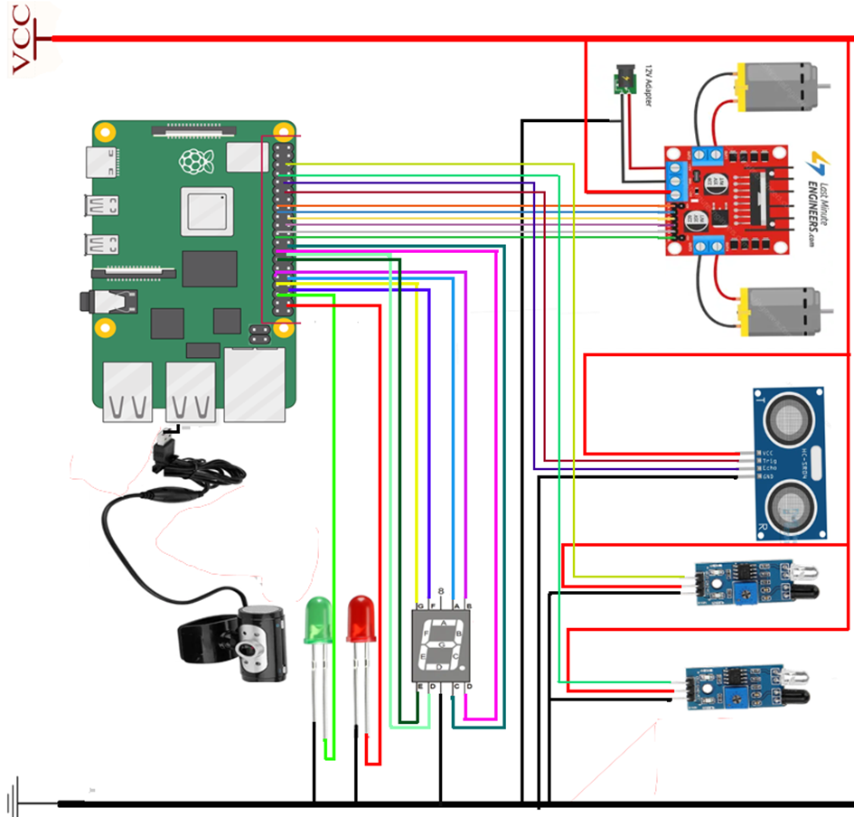
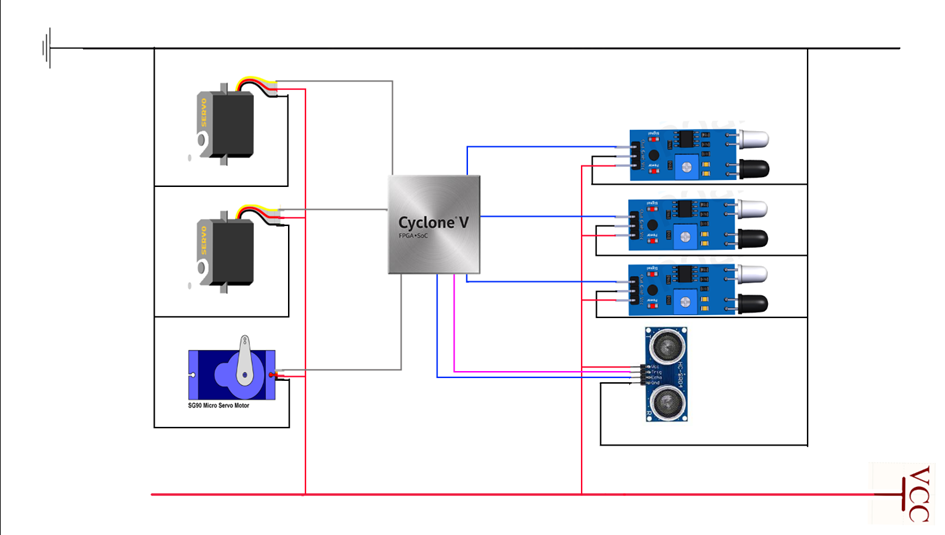
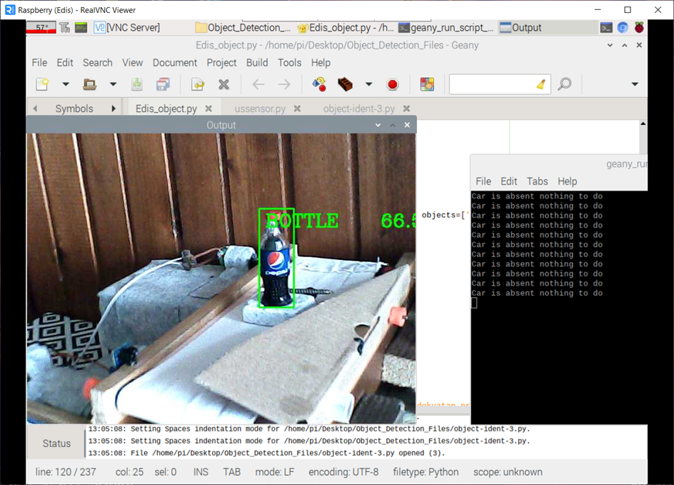

# Smart Factory Project
## Due to los of acctual project folder I could only upload the main codes of the project...
## Overview
This project focuses on designing a smart factory system that automates the sorting of objects based on their shape, specifically targeting recycling processes. The system consists of two main subsystems: a conveyor belt system and a smart robot. The conveyor belt system sorts objects using a camera and IR sensors, while the smart robot transports sorted objects to designated locations.

## Table of Contents
1. [Project Idea](#project-idea)
2. [Project Tasks](#project-tasks)
3. [Project Goals](#project-goals)
4. [Problem Description](#problem-description)
5. [Components](#components)
6. [System 1: Conveyor Belt System](#system-1-conveyor-belt-system)
   - [Process Logic](#process-logic)
   - [Hardware Components](#hardware-components)
7. [System 2: Smart Robot](#system-2-smart-robot)
   - [Process Logic](#process-logic-1)
   - [Hardware Components](#hardware-components-1)
8. [Hardware Realization](#hardware-realization)
9. [Project demo](#project-demo)
10. [OpenCV Algorithm](#opencv-algorithm)
11. [Schematics and Signal Response](#schematics-and-signal-response)
12. [Code](#code)
13. [Data Acquisition](#data-acquisition)
14. [Bonus Images](#bonus-images)
15. [References](#references)

---

## Project Idea
The project aims to automate the sorting of objects in a factory setting, particularly for recycling purposes. The system uses a conveyor belt with a camera to detect object shapes and IR sensors to sort objects into different categories. A smart robot is used to transport sorted objects to their designated locations.

---

## Project Tasks
- Create a conveyor belt system with two belts.
- Develop a program to control the conveyor belt movement.
- Implement a camera program to recognize object shapes and IR sensors.
- Design a smart robot with a 7-segment display for object transportation.

---

## Project Goals
- Familiarize with System-on-Chip (SoC) integrated circuits and FPGA platforms.
- Explore the Raspberry Pi microprocessor and its applications.
- Solve real-world problems related to object sorting and recycling.

---

## Problem Description
The system sorts objects based on their shape using a camera and IR sensors. Objects are placed on a conveyor belt, and the camera detects their shape. If the object is a bottle, it is sent to the right belt for recycling. Otherwise, it is sent to the left belt for disposal. A smart robot transports the sorted objects to their designated locations.

---

## Components
### System 1 (Conveyor Belt System)
- **2 DC Motors**
- **2 IR Sensors**
- **Raspberry Pi Camera Module 2**
- **Raspberry Pi Board**
- **7-Segment Display**
- **Ultrasonic Sensor**

### System 2 (Smart Robot)
- **FPGA Cyclone V**
- **Parallax Boe-Bot Robot**
- **Ultrasonic Sensor**
- **3 TCRT5000 IR Sensors**
- **Micro Servo 590 Motor**
- **2 Parallax Continuous Rotation Servo Motors**

---

## System 1: Conveyor Belt System
### Process Logic
1. The camera detects the object shape.
2. If the object is a bottle, it is sent to the right belt for recycling.
3. If the object is not a bottle, it is sent to the left belt for disposal.
4. The 7-segment display shows the number of sorted bottles.
5. The system stops if the robot is not in the correct position.

### Hardware Components
- **Camera**: Detects object shapes.
- **IR Sensors**: Detect objects on the conveyor belt.
- **DC Motors**: Control the conveyor belt movement.
- **7-Segment Display**: Shows the number of sorted bottles.
- **Ultrasonic Sensor**: Detects the robot's position.

---

## System 2: Smart Robot
### Process Logic
1. The robot waits for the ultrasonic sensor to detect an object.
2. The robot follows a line using IR sensors to transport the object.
3. The robot unloads the object and returns to its original position.

### Hardware Components
- **IR Sensors**: Detect the line for navigation.
- **Ultrasonic Sensor**: Detects objects in the robot's container.
- **Servo Motors**: Control the robot's movement and unloading mechanism.

---

## Hardware Realization
The hardware setup includes the conveyor belt system and the smart robot. The conveyor belt system is controlled by a Raspberry Pi, while the smart robot is controlled by an FPGA Cyclone V.

## Project Demo
Check out the demo video below:

---

## OpenCV Algorithm
The OpenCV algorithm is used for object detection. The system uses a pre-trained Deep Neural Network (DNN) model to detect objects such as bottles and cups. The camera captures images, and the DNN model processes them to identify objects.

---

## Schematics and Signal Response
### System 1
- **Schematic**: The conveyor belt system is connected to the Raspberry Pi, with IR sensors and DC motors controlling the belt movement.
- **Signal Response**: The system's response to IR sensor inputs is visualized using MATLAB.

### System 2
- **Schematic**: The smart robot is connected to the FPGA Cyclone V, with IR sensors and servo motors controlling its movement.
- **Signal Response**: The robot's movement and sensor responses are visualized using Arduino's serial plotter.

---

## Code
### System 1
The code for the conveyor belt system is written in Python and runs on the Raspberry Pi. It controls the camera, IR sensors, and DC motors.

### System 2
The code for the smart robot is written in Verilog and runs on the FPGA Cyclone V. It controls the IR sensors and servo motors.

---

## Data Acquisition
Data acquisition is performed using MATLAB for the conveyor belt system and Arduino's serial plotter for the smart robot. The data includes IR sensor readings and motor responses.

---

## Bonus Images
The project includes several images showing the system in action, including the terminal output and camera feed.

---

## References
1. [Intel Cyclone V FPGA](https://www.intel.com/content/www/us/en/products/details/fpga/cyclone/iv.html)
2. [Raspberry Pi Documentation](https://en.wikipedia.org/wiki/Raspberry_Pi)
3. [OpenCV Documentation](https://docs.opencv.org/4.x/d3/df1/classcv_1_1dnn_1_1DetectionModel.html)
4. [Parallax Boe-Bot Robot](https://www.parallax.com/product-category/boe-bot/)
5. [TCRT5000 IR Sensor](https://www.elprocus.com/tcrt5000-ir-sensor/)

---

This README provides an overview of the Smart Factory project, including its components, logic, and implementation. For more details, refer to the full project documentation.